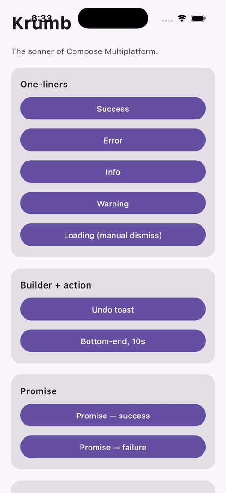

<div align="center">

# 🍞 Krumb

**The `sonner` of Compose Multiplatform** — a toast / snackbar / notification library that's callable from anywhere, beautiful by default, and feature-complete.

[](https://central.sonatype.com/namespace/io.github.nadeemiqbal)
[](https://github.com/NadeemIqbal/krumb/actions/workflows/ci.yml)
[](LICENSE)
[](https://kotlinlang.org)
[](https://www.jetbrains.com/lp/compose-multiplatform/)

**Android** · **iOS** · **Desktop (JVM)** · **Web (Wasm)**



</div>

---

## Why Krumb

Most toast libraries make you thread a `SnackbarHostState` through your composables. Krumb doesn't. Call it from a ViewModel, a coroutine, a click handler — anywhere:

```kotlin
Toaster.success("Profile saved")
```

It draws **its own Compose UI** on every platform — not `android.widget.Toast`, not an OS banner — so a toast looks and behaves identically on Android, iOS, Desktop, and Web.

| | |
|---|---|
| **Best DX** | One-liner global API · zero-config setup · promise pattern · callable from anywhere |
| **Best visuals** | Depth-stacked toasts · spring animations · swipe-to-dismiss · pause-on-hover · progress bar |
| **Best features** | Priority queue · update-by-handle · action buttons · custom composable content · programmatic dismiss |

## Platforms

| Platform | Target | Status |
|---|---|---|
| Android | `androidTarget()` | ✅ |
| iOS | `iosX64` / `iosArm64` / `iosSimulatorArm64` | ✅ |
| Desktop | `jvm` | ✅ |
| Web | `wasmJs` | ✅ |

## Install

In `gradle/libs.versions.toml`:

```toml
[versions]
krumb = "0.1.0"

[libraries]
krumb-material3 = { module = "io.github.nadeemiqbal:krumb-material3", version.ref = "krumb" }
```

In your shared module's `commonMain` (the `material3` artifact transitively pulls in `krumb-compose` + `krumb-core`):

```kotlin
commonMain.dependencies {
    implementation(libs.krumb.material3)
}
```

> Not on Material 3? Depend on `io.github.nadeemiqbal:krumb-compose` directly and supply your own `KrumbStyle`.

## Setup

Wrap your app once, near the root:

```kotlin
@Composable
fun App() {
    MaterialTheme {
        Material3ToasterHost {
            // your app content
        }
    }
}
```

That's it — no state to hoist, no host to pass around.

## Usage

```kotlin
// One-liners — callable from anywhere
Toaster.success("Profile saved")
Toaster.error("Network failed")
Toaster.info("3 new messages")
Toaster.warning("Battery low")
val handle = Toaster.loading("Uploading…")        // returns a handle

// Builder + action button
Toaster.show("Deleted item") {
    action("Undo") { viewModel.undo() }
    duration = 5.seconds
    position = ToastPosition.BottomCenter
}

// Promise — loading → success / error automatically
Toaster.promise(
    block = { repository.save() },
    loading = "Saving…",
    success = { "Saved successfully" },
    error = { e -> "Failed: ${e.message}" },
)

// Fully custom composable content
Toaster.custom(duration = 4.seconds) {
    Row { /* anything you want */ }
}

// Programmatic control
handle.update(message = "Done", type = ToastType.Success)
handle.dismiss()
Toaster.dismissAll()
```

### Priority & queue

Toasts beyond `maxVisible` are queued. `Priority.HIGH` jumps ahead and preempts the oldest `LOW` toast on screen:

```kotlin
Toaster.show("Critical alert") { priority = Priority.HIGH }
```

## Modules

| Artifact | Description |
|---|---|
| `krumb-core` | Pure-Kotlin engine — queue, controller, `Toaster` facade. No UI dependency, fully unit-tested. |
| `krumb-compose` | `ToasterHost` composable — stacking, spring animations, swipe-to-dismiss, pause-on-hover, progress bar, custom content. |
| `krumb-material3` | Material 3 themed defaults — semantic success/error/warning colors, theme-aware info/loading. |

## Sample apps

The [`sample/`](sample) directory has runnable showcases for every platform, all driven by one shared `SampleApp()`:

```bash
./gradlew :sample:desktopApp:run                       # Desktop
./gradlew :sample:androidApp:installDebug              # Android
./gradlew :sample:webApp:webBrowserDevelopmentRun      # Web  → localhost:8080
# iOS: open sample/iosApp/iosApp.xcodeproj in Xcode and run
```

## Contributing

Issues and PRs welcome — see [CONTRIBUTING.md](CONTRIBUTING.md). Maintainer release process is in [RELEASING.md](RELEASING.md).

## License

```
Copyright 2026 Nadeem Iqbal

Licensed under the Apache License, Version 2.0 — see the LICENSE file.
```
